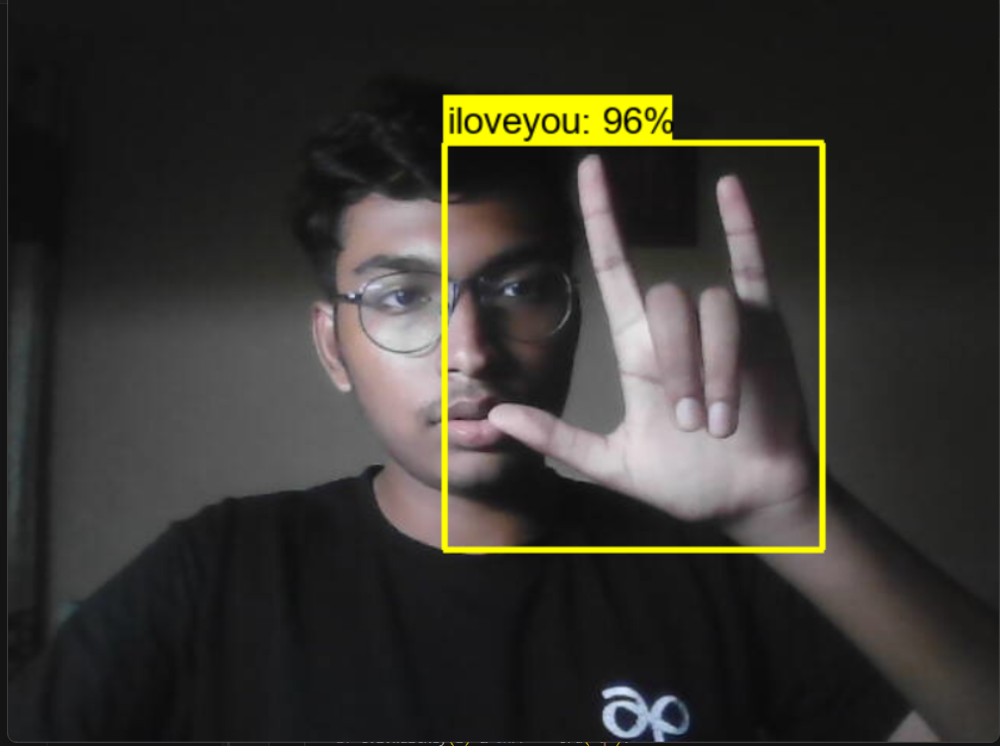

# Real Time Sign Language Detection

This project implements real-time sign language detection using TensorFlow Object Detection API and Python.

## Overview

This system uses computer vision and machine learning techniques to detect and interpret sign language gestures in real-time video streams. It can recognize various hand signs and translate them into text, enabling easier communication for deaf and hard-of-hearing individuals.

## Features

- Real-time sign language detection from webcam feed
- Support for [X number] of common sign language gestures
- Easy-to-use Python interface
- Utilizes TensorFlow Object Detection API for efficient and accurate detection

## Prerequisites

- Python 3.7+
- TensorFlow 2.x
- OpenCV
- Numpy

## Installation 

1. Clone this repository: git clone https://github.com/Siddhant1Raju/Real-Time-Sign-Detection.git

## Usage

1. Run the main script:Tutorial.ipynb
2. 2. Position your hands in front of the webcam and perform sign language gestures.
3. The detected signs will be displayed on the screen in real-time.

## Training Your Own Model

If you want to train the model on your own dataset:
1. Prepare your dataset following the TensorFlow Object Detection API guidelines.

## Demo

This image demonstrates the system detecting the ASL sign for "I love you" with 96% confidence. The yellow bounding box shows the area of interest, and the text above displays the detected sign and confidence level.

## Contributing

Contributions to this project are welcome. If you find any issues or have suggestions for improvements, please open an issue or submit a pull request on the project's GitHub repository.

## License

This project is licensed under the [MIT License](LICENSE).

